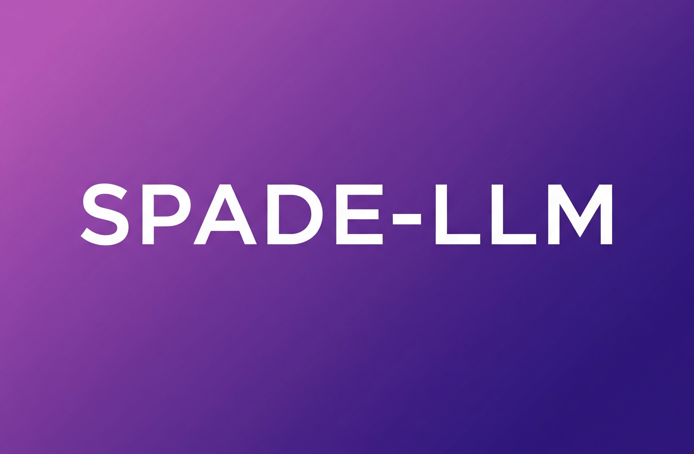

<div align="center">
  
</div>

<div align="center">


[](https://pypi.org/project/spade-llm/)
[](https://opensource.org/licenses/MIT)
[](https://pepy.tech/projects/spade-llm)
[](https://coveralls.io/github/javipalanca/spade_llm?branch=main)

[](https://github.com/javipalanca/spade_llm/actions)
[](https://github.com/javipalanca/spade_llm/actions/workflows/docs.yml)

[**Documentation**](https://spadeagents.eu/docs/spade_llm/) | [**Quick Start**](https://spadeagents.eu/docs/spade_llm/getting-started/quickstart/) | [**Examples**](https://spadeagents.eu/docs/spade_llm/reference/examples/) | [**API Reference**](https://spadeagents.eu/docs/spade_llm/reference/)

</div>

# SPADE-LLM: Large Language Model Integration for Multi-Agent Systems

**SPADE-LLM** is a Python framework that extends [SPADE](https://spadeagents.eu) multi-agent platform with Large Language Model capabilities. Build AI agents powered by OpenAI GPT, Ollama, LM Studio, and other LLM providers for multi-agent systems, with communication via XMPP for distributed AI applications.

**Keywords**: SPADE, LLM, large language models, multi-agent systems, AI agents, OpenAI, GPT, Ollama, chatbot framework, distributed AI, Python AI, agent communication, XMPP agents, AI collaboration

## Table of Contents

- [SPADE-LLM: Large Language Model Integration for Multi-Agent Systems](#spade-llm-large-language-model-integration-for-multi-agent-systems)
  - [Table of Contents](#table-of-contents)
  - [Key Features](#key-features)
  - [Installation instructions](#installation-instructions)
    - [Requirements](#requirements)
    - [Install](#install)
  - [Built-in XMPP Server](#built-in-xmpp-server)
    - [Start the Server](#start-the-server)
  - [Quick Start](#quick-start)
    - [Step 1: Start the Built-in XMPP Server](#step-1-start-the-built-in-xmpp-server)
    - [Step 2: Create and Run Your LLM Agent](#step-2-create-and-run-your-llm-agent)
  - [Examples](#examples)
    - [Multi-Provider Support](#multi-provider-support)
    - [Tools and Function Calling](#tools-and-function-calling)
  - [Documentation](#documentation)
  - [Contributing](#contributing)
  - [License](#license)

## Key Features


- **Built-in XMPP Server** - No external server setup needed! Start agents with one command
- **Multi-LLM Provider Support** - Integrate OpenAI models, Ollama local models, LM Studio and more.
- **Advanced Tool System** - Function calling, async execution, LangChain tool integration, custom tool development
- **Smart Context Management** - Multi-conversation support, automatic cleanup, sliding window, token-aware context
- **Persistent Memory** - Agent-based memory, conversation threading, long-term state persistence across sessions
- **Intelligent Message Routing** - Conditional routing based on LLM responses, dynamic agent selection
- **Content Safety Guardrails** - Input/output filtering, keyword blocking, content moderation, safety controls
- **MCP Integration** - Model Context Protocol server support for external tools and services
- **Human-in-the-Loop** - Web interface for human expert consultation, interactive decision making
<!-- --8<-- [start:setup_instructions] -->
## Installation instructions

### Requirements

- Python 3.10+
- (recommended) `uv` [installation](https://docs.astral.sh/uv/getting-started/installation/) for environment management

### Install

```bash
# Install with uv (recommended)
uv pip install spade_llm

# Or install with pip
pip install spade_llm

# If working on a project with uv
uv add spade_llm
```

For optional features:

```bash
# RAG support with ChromaDB
pip install spade_llm[chroma]   # or: uv add spade_llm --extra chroma

# LangChain tool integration
pip install spade_llm[langchain]   # or: uv add spade_llm --extra langchain
```
<!-- --8<-- [end:setup_instructions] -->

## Built-in XMPP Server

SPADE 4+ includes a built-in XMPP server, eliminating the need for external server setup. This is a major advantage over other multi-agent frameworks like AutoGen or Swarm that require complex infrastructure configuration.

### Start the Server

```bash
# Start SPADE's built-in XMPP server
spade run
```

The server automatically handles:
- Agent registration and authentication
- Message routing between agents
- Connection management
- Domain resolution

Agents automatically connect to the built-in server when using standard SPADE agent configuration.

## Quick Start

Get started with SPADE-LLM in just 2 steps:

### Step 1: Start the Built-in XMPP Server

```bash
# Terminal 1: Start SPADE's built-in server
spade run
```

### Step 2: Create and Run Your LLM Agent

```python
# your_agent.py
import spade
from spade_llm import LLMAgent, LLMProvider

async def main():
    provider = LLMProvider(
        model="gpt-4o-mini",
        api_key="your-api-key",
    )
    
    agent = LLMAgent(
        jid="assistant@localhost",  # Connects to built-in server
        password="password",
        provider=provider,
        system_prompt="You are a helpful assistant"
    )
    
    await agent.start()

if __name__ == "__main__":
    spade.run(main())
```

```bash
# Terminal 2: Run your agent
python your_agent.py
```


## Examples

### Multi-Provider Support

```python
# OpenAI
provider = LLMProvider(model="gpt-5.4", api_key="key")

# Ollama (local)
provider = LLMProvider(model="ollama/llama3.1:8b")

# Any OpenAI-compatible API (LM Studio, vLLM, etc.)
provider = LLMProvider(model="openai/local-model", base_url="http://localhost:1234/v1")
```

### Tools and Function Calling

```python
from spade_llm import LLMTool

async def get_weather(city: str) -> str:
    return f"Weather in {city}: 22°C, sunny"

weather_tool = LLMTool(
    name="get_weather",
    description="Get weather for a city",
    parameters={
        "type": "object",
        "properties": {"city": {"type": "string"}},
        "required": ["city"]
    },
    func=get_weather
)

agent = LLMAgent(
    jid="assistant@localhost",  # Uses built-in server
    password="password",
    provider=provider,
    tools=[weather_tool]
)
```


## Documentation

- **[Installation](https://spadeagents.eu/docs/spade_llm/getting-started/installation/)** - Setup and requirements
- **[Quick Start](https://spadeagents.eu/docs/spade_llm/getting-started/quickstart/)** - Basic usage examples
- **[Providers](https://spadeagents.eu/docs/spade_llm/guides/providers/)** - LLM provider configuration
- **[Tools](https://spadeagents.eu/docs/spade_llm/guides/tools-system/)** - Function calling system
- **[Guardrails](https://spadeagents.eu/docs/spade_llm/guides/guardrails/)** - Content filtering and safety
- **[API Reference](https://spadeagents.eu/docs/spade_llm/reference/)** - Complete API documentation

## Contributing

See [Contributing Guide](https://spadeagents.eu/docs/spade_llm/contributing/).

## License

MIT License
