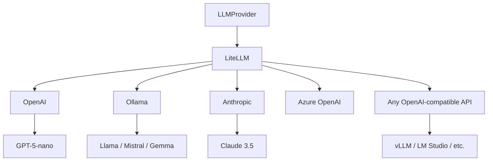

# LLM Providers

SPADE_LLM supports **multiple LLM providers** through a _unified interface_, enabling seamless switching between different AI services.

## Provider Architecture

SPADE-LLM uses **[LiteLLM](https://docs.litellm.ai/)** as a unified backend, giving you access to **100+ LLM providers** through a single interface.



## Supported Providers

The **unified LLMProvider** uses the [LiteLLM model format](https://docs.litellm.ai/docs/providers) (`provider/model-name`):

- **OpenAI** - GPT models (model name directly, e.g. `gpt-5-nano`)
- **Anthropic** - Claude models (prefix `anthropic/`, e.g. `anthropic/claude-sonnet-4-6`)
- **Ollama** - Local models (prefix `ollama/`, e.g. `ollama/gpt-oss-20b`)
- **OpenAI-compatible API** - For vLLM, LM Studio or custom endpoints; use the `openai/` prefix with custom `base_url`.

## OpenAI

**Cloud-based LLM service** with state-of-the-art models:

```python
from spade_llm.providers import LLMProvider

provider = LLMProvider(
    model="gpt-5-nano",
    api_key="your-api-key",
    temperature=0.7,
)
```

## Ollama

**Local deployment** for privacy and control:

```python
provider = LLMProvider(
    model="ollama/llama3.1:8b",
)
```

## OpenAI-Compatible APIs (LM Studio, vLLM, etc.)

For any OpenAI-compatible API server, use the `openai/` prefix with a custom `base_url`:

```python
# LM Studio
provider = LLMProvider(
    model="openai/local-model",
    base_url="http://localhost:1234/v1",
)

# vLLM
provider = LLMProvider(
    model="openai/gpt-oss-120b",
    base_url="http://localhost:8000/v1",
)
```

Start vLLM server:
```bash
python -m vllm.entrypoints.openai.api_server \
    --model openai/gpt-oss-120b \
    --port 8000
```

## Embeddings

LLMProvider supports **generating embeddings** for RAG (Retrieval-Augmented Generation) systems.

### What are Embeddings?

**Embeddings** are dense vector representations of text that capture semantic meaning in high-dimensional space. Similar texts have similar embeddings, enabling:

- **Semantic search**: Find documents by meaning, not just keywords
- **Clustering**: Group similar content together
- **Recommendations**: Suggest related documents
- **RAG systems**: Retrieve relevant context for LLM queries

### OpenAI Embeddings

```python
from spade_llm.providers import LLMProvider

provider = LLMProvider(
    model="text-embedding-3-small",
    api_key="your-api-key",
)

# Generate embeddings
embeddings = await provider.get_embeddings([
    "First document text",
    "Second document text"
])

# Each embedding is a list of floats
print(f"Dimensions: {len(embeddings[0])}")  # e.g., 1536
```

### Ollama Embeddings

```python
provider = LLMProvider(
    model="ollama/nomic-embed-text",
)

embeddings = await provider.get_embeddings([
    "Document content here",
    "Another document"
])
```

### Usage in RAG Systems

```python
from spade_llm.rag import Chroma, VectorStoreRetriever
from spade_llm.providers import LLMProvider

# Setup embedding provider
embedding_provider = LLMProvider(
    model="ollama/nomic-embed-text",
)

# Use in vector store
vector_store = Chroma(
    collection_name="knowledge_base",
    embedding_fn=embedding_provider.get_embeddings
)

await vector_store.initialize()
```

**Important**: Use the **same embedding model** for both indexing documents and querying.

## Best Practices

- **Test multiple providers** during development to find the best fit
- **Implement fallback systems** for critical applications
- **Use environment variables** for easy configuration management
- **Monitor provider performance** and costs in production
- **Choose models** based on your specific use case requirements

## Next Steps

- **[Tools System](tools-system.md)** - Add tool capabilities to your providers
- **[RAG System](rag-system.md)** - Use embeddings for retrieval-augmented generation
- **[Architecture](architecture.md)** - Understanding the provider layer
- **[Routing](routing.md)** - Route responses based on provider capabilities
